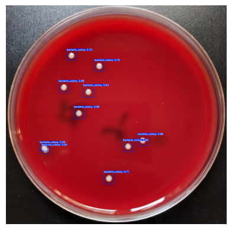
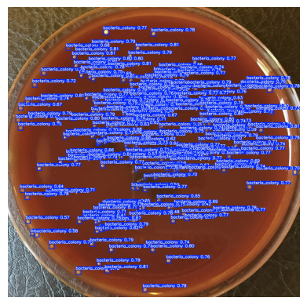

# Deep-Learning-And-Image-Analysis-of-Bacterial-Colonies-with-PyTorch

### Project Overview
This is an ongoing project. In microbiology, counting bacterial colonies is essential but time-consuming. This project automates colony counting through a YOLOv5 deep learning model trained to identify bacterial colonies. It is highly applicable in automating repetitive lab tasks. The model has to undergo fine-tuning and further analysis to improve key accuracy metrics.
This project utilizes YOLOv5 for the automated detection of bacterial colonies in lab-cultured samples. By leveraging the power of deep learning, specifically object detection, this model can identify and quantify bacterial colonies in high-resolution images, enabling faster analysis for researchers and lab technicians.


### Dataset
The dataset is from Solymosi, Norbert; Nagy, Sára (2023). Annotated dataset for deep-learning-based bacterial colony detection. figshare. Dataset. 
[![View on Figshare]]((https://doi.org/10.6084/m9.figshare.22022540.v3))

The annotated bacterial colony images with labels formatted in YOLO format.

- **Train Images**: 221
- **Validation Images**: 74
- **Test Images**: 74

## Inference Results

The following results were generated using the exported model on unseen test data:




### Installation
1. Clone the repository:
   ```bash
   git clone https://github.com/djcode81/BactoVision.git
 
